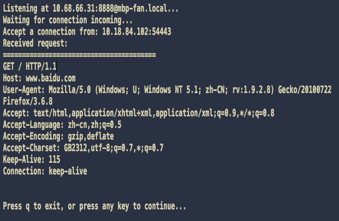
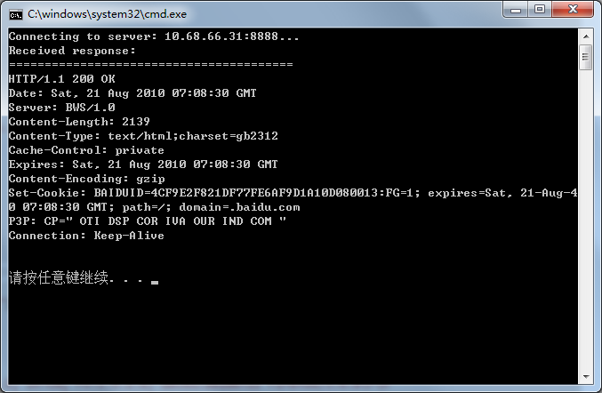

## 基于socket的C/S通信示例
本工程为《[WinSock编程基础](http://blog.csdn.net/phunxm/article/details/5085869)》的第四节TCP C/S通信示例代码，基于默认的同步阻塞 I/O 模型。

该示范程序模拟了一个最简化的 C/S 交互流程。  
客户端请求的 HTTP Request 报文和服务器返回的 HTTP Response 报文摘自《[TCP通信流程解析](http://blog.csdn.net/phunxm/article/details/5836034)》中抓包请求百度首页的 TCP 流。

该测试代码已跨平台适配 Windows 和 Mac OS X，可在 Visual Studio 2012 和 Xcode 下编译通过。

测试时，最好先启动服务器。

### serverDemo
服务器端示例程序。

有客户连接上之后，被动等待客户请求（模拟 HTTP REQUEST），然后回包（模拟 HTTP RESPONSE），关闭连接。

可通过修改 **LOCAL_ENDPOINT_PORT** 宏定义来调整服务监听端口，示例程序中的默认端口是  8888。

serverDemo 运行示范效果：  

处理完一个客户后，可按下 <kbd>q</kbd> 键退出，或按其他任意键继续进入下一轮  while(true) 循环。此时，可重新启动一个 clientDemo 再次测试。

### clientDemo
客户端端示例程序。

连接上服务器之后，模拟发送 HTTP GET 报文。

1. 可通过修改 **SERVER_ENDPOINT_IP** 宏定义来指定要连接的服务器 IP 地址（在运行  serverDemo 的机器上通过 `ipconfig` 或 `ifconfig` 命令可获取本机 IP）；  
2. 通过修改 **SERVER_ENDPOINT_PORT** 宏定义来指定要连接的服务器端口，与 serverDemo 中指定的 **LOCAL_ENDPOINT_PORT** 对应。

serverDemo 运行示范效果：  
